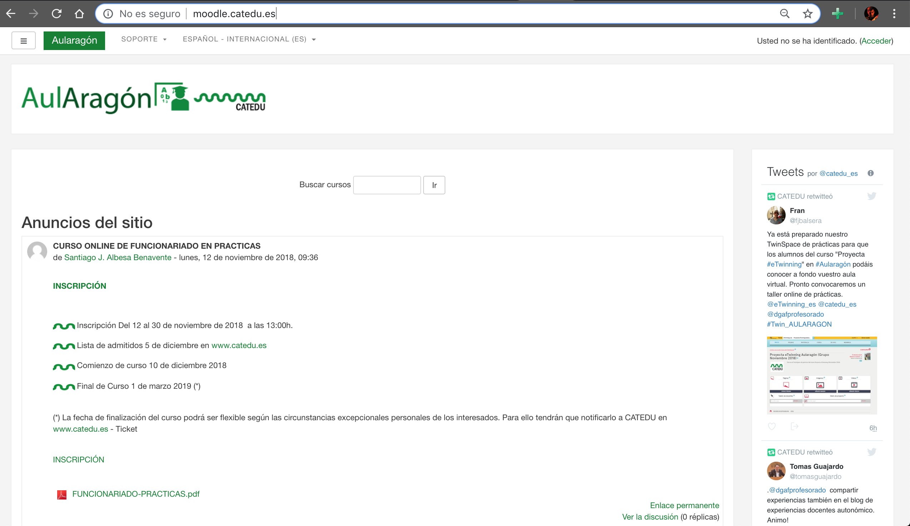
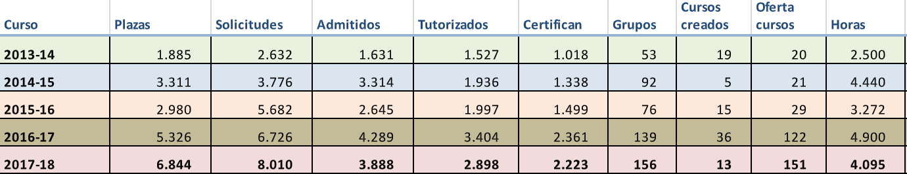
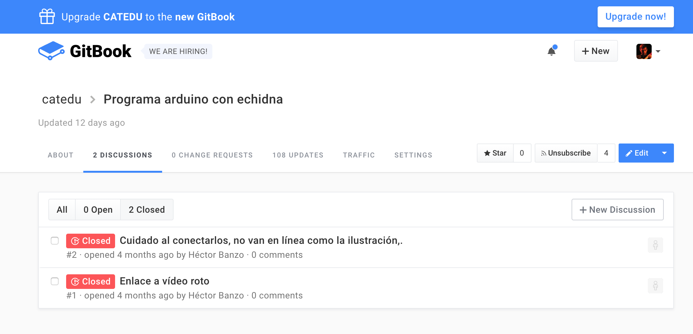
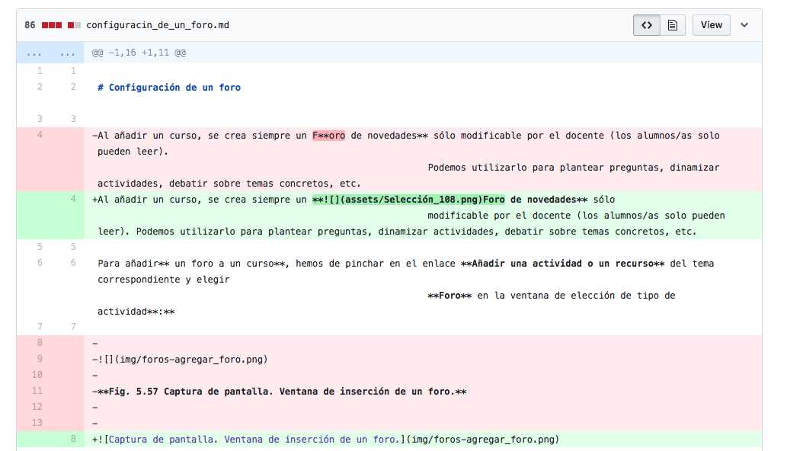
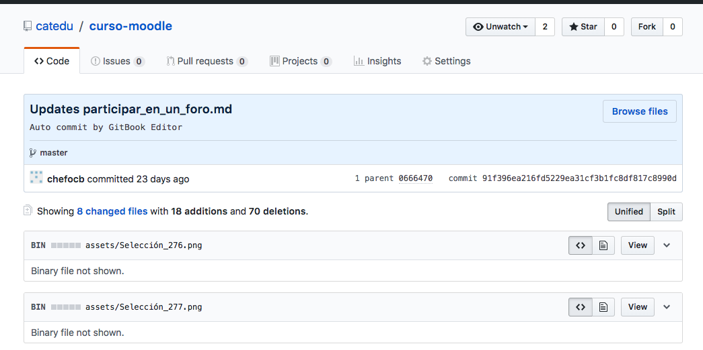
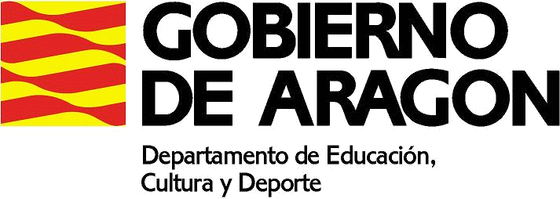

# CATEDU

(Centro Aragonés de Tecnologías para la Educación - Aragonese Center of Technologies for Education)

[www.catedu.es](http://www.catedu.es)

---

<!-- .slide: data-background-iframe="http://catedu.es" data-background-interactive -->

---

### What does CATEDU offer?

* Online learning resources and platform, for teachers (and for those who ever might be interested)
* Services and support for teachers
* Organization of the ICT Advisors seminar

---

## Our Moodle

Note: Enseño el moodle, voy al curso de Arduino con código y muestro los materiales

---

## [Our content in gitbook](https://legacy.gitbook.com/@catedu)

---

## Our Services

#### [Moodle for Teachers](http://catedu.aragon.es/moodle/)

---

## Our Services

#### [Wordpress for Schools and Teachers](https://iesvaldespartera.catedu.es/)

 <!-- .element height="50%" width="50%" -->

---

## Our Services

#### Ftp space

 <!-- .element height="50%" width="50%" -->

---

<!-- .slide: data-background-iframe="http://wp.catedu.es/seminariotic/" data-background-interactive -->

---

## Contents of our courses in numbers

* 87 courses
* 3 calls including summertime.
* Support for courses carried out by other Teachers Trainning Centers.
* 171.793 total visits (from september to 21st june)
* 11.222 unique visits (from september to 21st june)
* 2.867 downloads (from september to 21st june)
* 4.222 pages in 87 libros

---

### Numbers of courses and participants

 <!-- .element height="120%" width="120%" -->

| year | posts | Applications | Admited | Supervised | Certificates | Groups | Hours |
|:--|:--|:--|:--|:--|:--|:--|:--|
|2017-18|6.844|8.010|3.888|2.898|2.223|156|4.095|

---

### What could be interesting for you?

* Our robotic courses, in which we lend the material (the robot itself)
* Our ICT approche covers different subjects (Maths, a secure network for minors, languages...)
* Our system for managing documentation

---

<!-- .slide: data-background-iframe="https://catedu.gitbooks.io/robotica/content/" data-background-interactive -->

---

<!-- .slide: data-background-iframe="https://catedu.gitbooks.io/matematicas-y-las-tic/content/" data-background-interactive -->

---

<!-- .slide: data-background-iframe="https://catedu.gitbooks.io/convivencia-segura-en-la-red/content/" data-background-interactive -->

---

<!-- .slide: data-background-iframe="https://catedu.gitbooks.io/lengua-y-literatura-con-las-tic/content/" data-background-interactive -->

---

## Managing our content

---

---

---

---

<!-- .slide: data-background-iframe="img/estatistics.html" data-background-interactive -->

---

<!-- .slide: data-background-iframe="img/topics.html" data-background-interactive -->

---

### How to access our content

* [http://moodle.catedu.es](http://moodle.catedu.es)
* [https://legacy.gitbook.com/@catedu](https://legacy.gitbook.com/@catedu)

---

# Thank you

---

